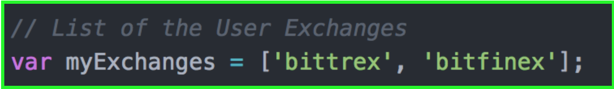
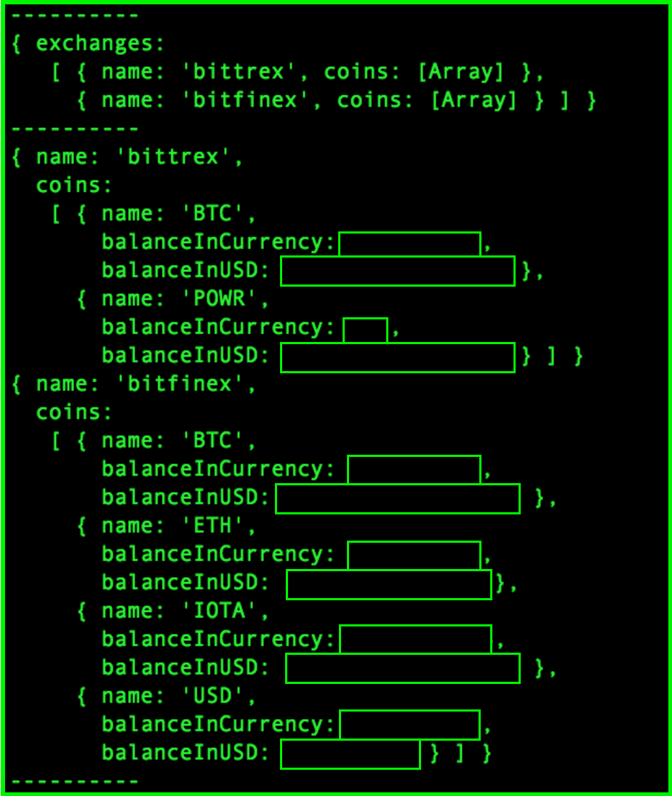

# Digital Asset Central Portfolio
A library for cryptoasset investors to access their portfolio

In the cryptosphere, there are many investors that spend their time on cryptoasset exchanges. Even though it is considered to be unsafe, traders still will keep their funds short term trades and others. Since many investors use multiple
exchanges (because they all differ in many ways), it is difficult to keep track of one's portfolio and true asset value.

DACP serves as a way for investors and traders to access personal information from the exchanges they use. The main focus of the repository is to gather an investor's holdings and the value from the cryptoasset exchanges they use in one central dataset named the balanceDataset. Another project that is in development is the transactionDataset, a dataset which aims to hold an investors trading transactions in one dataset, which can be useful in assessing the profitability of a certain transacetion and much more. 

The repository will use [CCXT](https://github.com/ccxt/ccxt), a library that accesses the API from
cryptoasset exchanges, to pull all the information needed from the particular exchanges.

## How to set up the Software

### Clone the Repository

### Exchange API Access

There are certain security protocols used to privatize user personal information on exchanges. In order to access the API, a user needs to ask for an API key in order to be authorized to access the personal information.

DACP uses a .env file to hold all the API keys and secrets needed to access the personal information in the given exchanges. The software also needs an array to be filed in before running. Follow the next two steps to properly set up the software.

#### Creating a .env file

In the directory of your project, create a .env file. You can do this in the terminal, or using a text editor application. To do this in the terminal, navigate to the current project directory. Type `touch .env` and hit enter. Then type `open .env` and hit enter. This would have opened a .env file in a text editor.

Add the API key and secret key as follows:

`EXCHANGENAME_apiKey=YOURAPIKEY`

`EXCHANGENAME_secret=YOURSECRETKEY`

For example, if I were using bitfinex, I would enter my keys in the .env file on separate lines as follows. Remember, you can add as many exchange keys as you want.

`bitfinex_apiKey=MYAPIKEY`

`bitfinex_secret=MYSECRETKEY`

Once you have entered all keys and secrets for the exchanges you would like to add to the dataset, save and close.

This file is included in the .gitignore to ensure that contributors do not share their personal
information while contributing.

#### Listing the Exchanges

In the balanceDataset.js file, the is an array named myExchanges. In this array, list the exchanges that you would like to access by using the exchange id (please refer to the [CCXT Manual](https://github.com/ccxt/ccxt#supported-cryptocurrency-exchange-markets) for the proper format of the exchange id). The array should be formatted as shown below.

## How it Works

By using the .env file and the myExchange array as the two inputs, the software will output a JSON of the balances of the coins in the exchanges.

The balance is shown in both the given coin (meaning how much of the specific coin is owned), as well as the value of the holding in USD. Currently, the software only works with the US Dollar as the base currency. The following is an example of what the output looks like (with the numbers hidden for privacy reasons).

### Using CCXT

CCXT offers functions, symbols and commands generalized for all exchanges in order to ease the use of the exchange API's. The functions used in the DACP library consist of the calls to access current price in a market, fetching a balance, fetching markets, and others.

### How to get USD value

In order to get the USD equivalent value for each holding on a particular exchange, the software needs to look for a connection to the US Dollar through it's markets. If there is a direct connection to the USD, it chooses that immediately. If not, will search through connections that can be made through base coins such as BTC and ETH. If there is no connection to USD on the exchange, the software will look at Bitfinex (a notable exchange that offers BTC/USD and ETH/USD markets) to get the price from BTC or ETH to USD.

The price of the coin in USD is then multiplied by the balance of the coin to show its value in USD.

The path needed to find a connection from the coin currency to USD is printed in the terminal to show how the conversion was done.

## License

This repository is licensed under the MIT License. Details can found in the [license file](https://github.com/Pyeskyhigh/DACP/blob/master/LICENSE).

## Contributors & Followers

Help is greatly appreciated as long as people follow the [Contributing](https://github.com/Pyeskyhigh/DACP/blob/master/CONTRIBUTING.md) rules and the [Code of Conduct](https://github.com/Pyeskyhigh/DACP/blob/master/CODE_OF_CONDUCT.md).

Please refer to the [to do list](https://github.com/Pyeskyhigh/DACP/blob/master/todo.md) to see where help is needed.  

